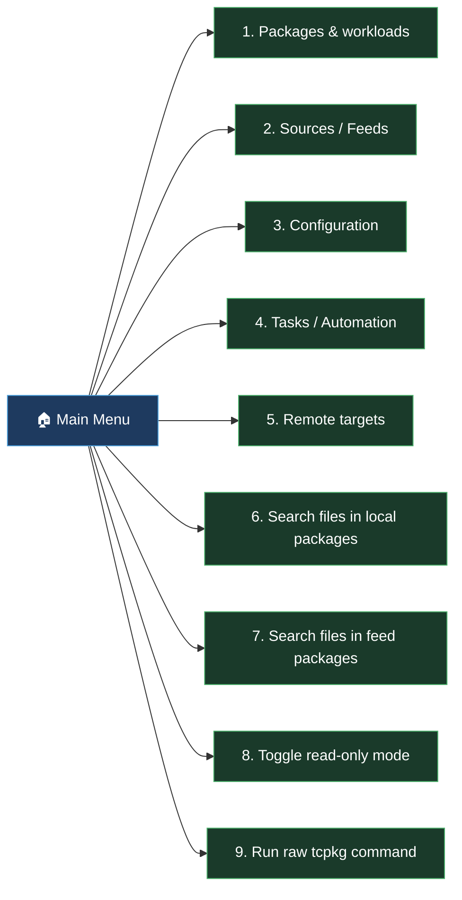
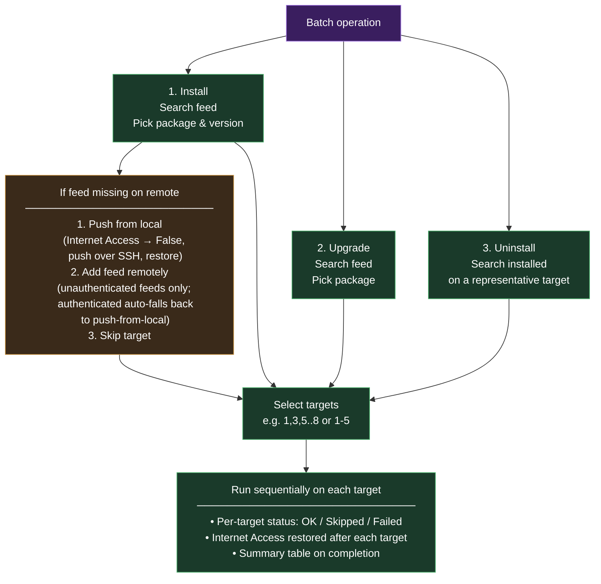
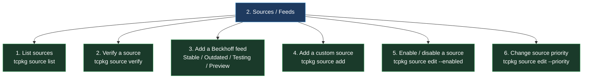
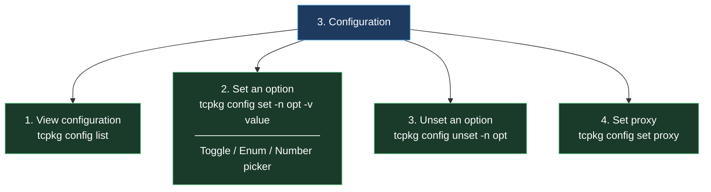
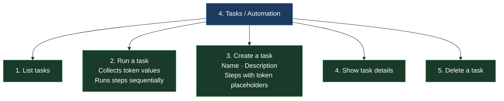
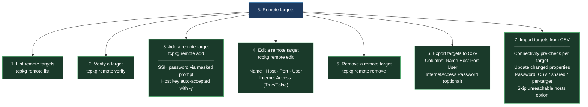
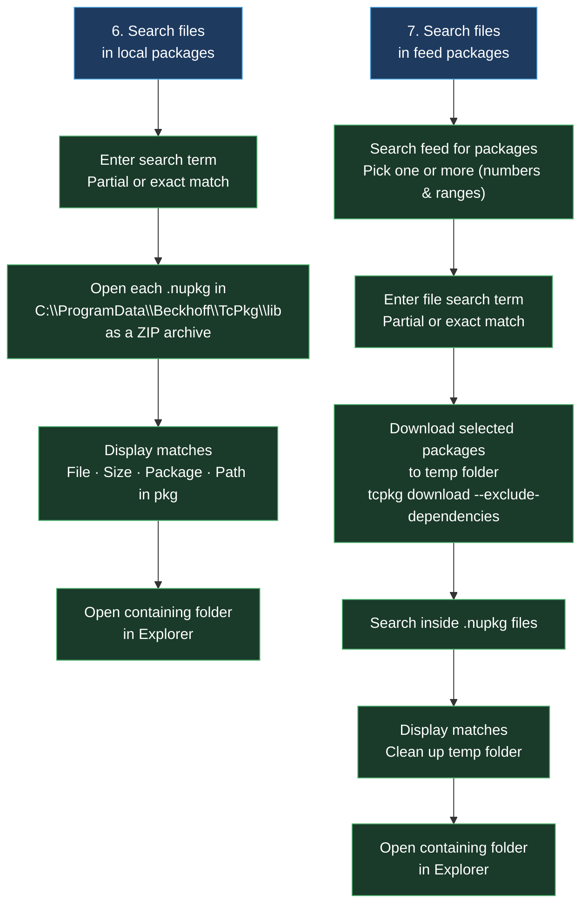

# TcPkgMgr

A PowerShell ISE menu system for the TwinCAT Package Manager (`tcpkg`).  
Wraps every `tcpkg` command in a numbered, guided interface with read-only preview mode, remote target management, batch operations, and CSV import/export.

---

## Quick start

1. Open `TcPkgMgr.ps1` in the PowerShell ISE.
2. Press **F5** to run.
3. The script starts in **read-only mode** — all commands are shown but not executed. Use this to explore the menus and verify commands before making changes.
4. Select **8. Toggle read-only mode** from the main menu when you are ready to execute commands.

**Requirements:** Windows PowerShell 5.1 (ISE) · `tcpkg` on `PATH` · Administrator privileges for most package operations

---

## Menu structure

### Main menu

---

<strong>1. Packages &amp; workloads</strong>

```mermaid
flowchart TD
    PKG["1. Packages & workloads"]

    PKG --> P1["1. List available packages\ntcpkg list"]
    PKG --> P2["2. Search / list installed\ntcpkg list -i"]
    PKG --> P3["3. List upgradable\ntcpkg list -o"]
    PKG --> P4["4. List workloads\ntcpkg list -t workload"]
    PKG --> P5["5. Show package details\ntcpkg show"]
    PKG --> P6["6. List all versions\ntcpkg list -a"]
    PKG --> P7["7. Show dependency tree\ntcpkg resolve --dependency-tree"]
    PKG --> P8["8. Install a package"]
    PKG --> P9["9. Upgrade a package"]
    PKG --> P10["10. Repair a package\ntcpkg repair"]
    PKG --> P11["11. Uninstall a package"]
    PKG --> P12["12. Search for a package\ntcpkg list term"]
    PKG --> P13["13. Batch operation\non multiple targets"]

    P8  --> P8A["Single target\n→ Package browser\n→ Pick version\n→ Pick target"]
    P8  --> P8B["Multiple targets\n→ Batch operation"]
    P9  --> P9A["Single target\n→ Package browser"]
    P9  --> P9B["Multiple targets\n→ Batch operation"]
    P9  --> P9C["Upgrade ALL\ntcpkg upgrade all"]
    P11 --> P11A["Single target\n→ Installed list picker"]
    P11 --> P11B["Multiple targets\n→ Batch operation"]
    P11 --> P11C["Uninstall ALL\ntcpkg uninstall all"]

    P8B & P9B & P11B & P13 --> BATCH["Batch operation\n(see below)"]

    classDef menu   fill:#1e3a5f,stroke:#4a9eda,color:#fff
    classDef action fill:#1a3a2a,stroke:#4aaf6a,color:#fff
    classDef batch  fill:#3a1e5f,stroke:#9a6eda,color:#fff
    classDef info   fill:#3a2a1a,stroke:#cf9a4a,color:#fff
    class PKG menu
    class P1,P2,P3,P4,P5,P6,P7,P8,P9,P10,P11,P12,P13 action
    class P8A,P8B,P9A,P9B,P9C,P11A,P11B,P11C info
    class BATCH batch
```

#### Batch operation

Runs the same action sequentially across multiple remote targets.  
Targets are selected using numbers and ranges — both `1,3,5..8` and `1,3,5-8` syntax are supported.

> **Note on parallelism:** tcpkg holds a system-wide lock for the full duration of every command (including the initial compatibility check). Only one tcpkg process can run at a time on the local machine, so true parallel execution is not possible. All batch operations run sequentially.

---

<strong>2. Sources / Feeds</strong>

---

<strong>3. Configuration</strong>

---

<strong>4. Tasks / Automation</strong>

---

<strong>5. Remote targets</strong>

---

<strong>6 &amp; 7. File search (local &amp; feed)</strong>

---

## Key features

| Feature | Description |
|---|---|
| **Read-only mode** | Default at startup — every tcpkg command is shown but not executed. Toggle with option 8. |
| **Package browser** | Browse feeds, see install status per target, pick version from a table showing version and feed |
| **Batch operations** | Install / upgrade / uninstall the same package across multiple remote targets. Targets selected with numbers and ranges (`1,3,5..8` or `1,3,5-8`). Always sequential — tcpkg's system-wide lock prevents parallel execution from one machine. |
| **Missing feed handling** | When a required feed is not on a remote target, choose per batch: push from local (Internet Access toggled to False and restored), add feed remotely (unauthenticated feeds), or skip the target. Authenticated remote feed add falls back to push-from-local automatically. |
| **Remote target management** | Add, edit, verify targets via SSH. CSV export/import with optional password column, connectivity pre-check, and automatic property update on import. |
| **Feed management** | Add Beckhoff feeds, custom feeds, enable/disable, set priority cascade |
| **File search** | Search inside `.nupkg` archives in the local package cache or download from a feed to search. Supports partial and exact matching. |
| **Task automation** | Define multi-step tcpkg workflows with `{{token}}` placeholders for runtime values |
| **Remote install status** | Installed-package index fetched from the selected target — shows correct up-to-date / upgradable / not-installed status per machine |

---

## Known limitations

| Limitation | Detail |
|---|---|
| **No parallel batch execution** | tcpkg holds a system-wide lock for the full duration of every command. Running two tcpkg processes simultaneously on the same machine results in `TcPkg is already running`. All batch operations are sequential. |
| **No authenticated remote feed add via ISE** | `tcpkg source add -r --password-stdin` is not supported by tcpkg for authenticated feeds. Adding an authenticated feed to a remote machine requires logging into that machine and running the command directly in PowerShell. Unauthenticated feeds can be added remotely without issue. |
| **Interactive stdin not available in ISE** | The PowerShell ISE does not support interactive stdin for child processes. Commands that require interactive prompts (e.g. `tcpkg remote add -p`) are handled by collecting input via `Read-Host` and piping it to the process. |